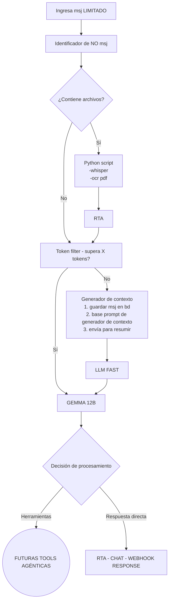

# Arquitectura del Workflow N8N - Sistema de Chat Inteligente

## Descripción General

Este documento describe la arquitectura del workflow de N8N para el sistema de chat inteligente Wuzi, que procesa mensajes multimodales de forma optimizada y eficiente.

## Diagrama de Flujo

## Componentes del Sistema

### 1. Entrada Limitada
- **Función**: Control de límites de entrada para prevenir sobrecarga
- **Implementación**: Validación en frontend antes del envío
- **Límites**: Caracteres, tokens, tamaño de archivos

### 2. Identificador de Contenido
- **Función**: Detecta el tipo de contenido (texto, imagen, audio, PDF)
- **Lógica**: Análisis de MIME types y extensiones
- **Routing**: Dirige hacia procesamiento especializado o flujo normal

### 3. Procesamiento de Archivos
- **Whisper**: Transcripción de audio a texto
- **OCR**: Extracción de texto de imágenes
- **PDF Parser**: Extracción de contenido de documentos PDF
- **Output**: Texto procesado para análisis posterior

### 4. Filtro de Tokens
- **Función**: Evalúa si el contenido supera límites de tokens
- **Decisión**: Procesamiento directo vs. optimización de contexto
- **Configuración**: Límites ajustables según modelo y recursos

### 5. Generador de Contexto
- **Paso 1**: Persistencia del mensaje en base de datos
- **Paso 2**: Aplicación de prompt base para generación de contexto
- **Paso 3**: Envío para resumir y optimizar
- **Output**: Contexto optimizado para LLM

### 6. LLM FAST
- **Función**: Procesamiento rápido de contexto
- **Objetivo**: Generar resúmenes y contexto optimizado
- **Características**: Modelo ligero y rápido

### 7. GEMMA 12B (Cerebro Central)
- **Función**: Modelo principal de decisión y procesamiento
- **Inputs**: Contexto del LLM FAST, contenido procesado, metadatos
- **Decisiones**: Respuesta directa vs. activación de herramientas
- **Capacidades**: Razonamiento complejo, análisis multimodal

### 8. Futuras Herramientas Agénticas
- **Función**: Extensibilidad para capacidades avanzadas
- **Ejemplos**: Búsqueda web, análisis de datos, generación de código
- **Arquitectura**: Modular y escalable

### 9. Respuesta Final
- **Función**: Formateo y envío de respuesta al webhook
- **Formato**: JSON estructurado con campo 'content'
- **Metadatos**: Información de procesamiento, tokens utilizados

## Flujos de Procesamiento

### Flujo A: Mensaje de Solo Texto (Bajo Token Count)
1. Entrada → Identificador → Token Filter (No supera)
2. Generador de Contexto → LLM FAST → GEMMA 12B
3. Respuesta directa → Webhook Response

### Flujo B: Mensaje con Archivos
1. Entrada → Identificador → Procesamiento Especializado
2. Python Scripts (Whisper/OCR/PDF) → Token Filter
3. Continúa según límite de tokens

### Flujo C: Mensaje de Alto Token Count
1. Entrada → Token Filter (Supera límite)
2. Directo a GEMMA 12B (sin contexto adicional)
3. Procesamiento optimizado → Respuesta

### Flujo D: Activación de Herramientas
1. GEMMA 12B determina necesidad de herramientas
2. Activación de módulos agénticos
3. Procesamiento especializado → Respuesta enriquecida

## Consideraciones Técnicas

### Performance
- **Paralelización**: Procesamiento de archivos en paralelo
- **Caching**: Resultados de OCR y transcripciones
- **Optimización**: Límites dinámicos según carga del sistema

### Escalabilidad
- **Modularidad**: Componentes independientes
- **Load Balancing**: Distribución de carga entre modelos
- **Resource Management**: Gestión inteligente de recursos

### Monitoreo
- **Métricas**: Tiempo de procesamiento, uso de tokens, errores
- **Logging**: Trazabilidad completa del flujo
- **Alertas**: Notificaciones por fallos o límites excedidos

## Integración con Frontend

### Requerimientos del Cliente
1. **Límites de Entrada**: Validación previa al envío
2. **Indicadores de Progreso**: Estados de procesamiento
3. **Notificaciones**: Sistema push para respuestas asíncronas
4. **Manejo de Archivos**: Upload optimizado y validación
5. **Contador de Tokens**: Estimación en tiempo real

### Estados de Mensaje
- `sending`: Enviando al servidor
- `processing`: En procesamiento (archivos, análisis)
- `thinking`: Modelo generando respuesta
- `completed`: Respuesta recibida
- `error`: Error en procesamiento

## Próximos Pasos

1. Implementación del workflow base en N8N
2. Desarrollo de scripts de procesamiento (Python)
3. Integración con modelos LLM
4. Testing y optimización de flujos
5. Implementación de sistema de notificaciones
6. Desarrollo de herramientas agénticas futuras